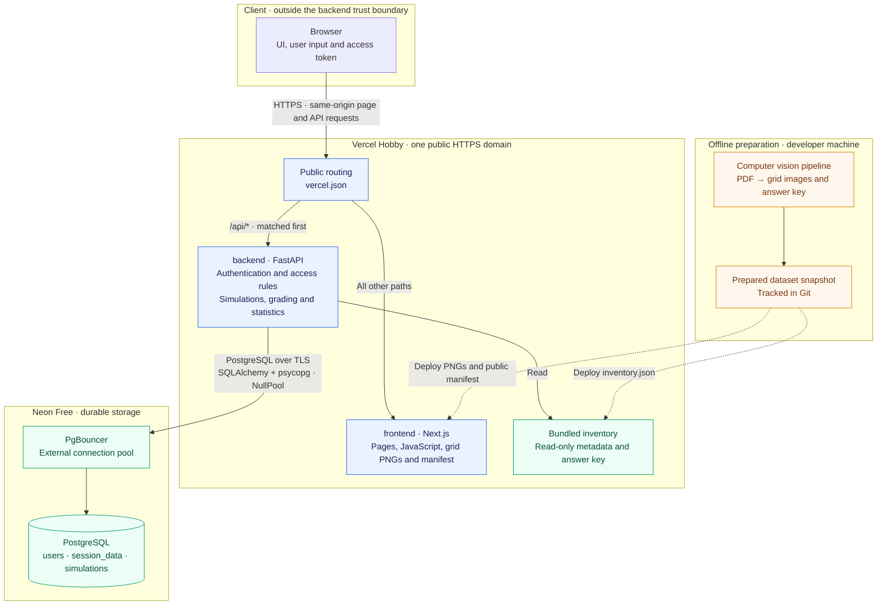
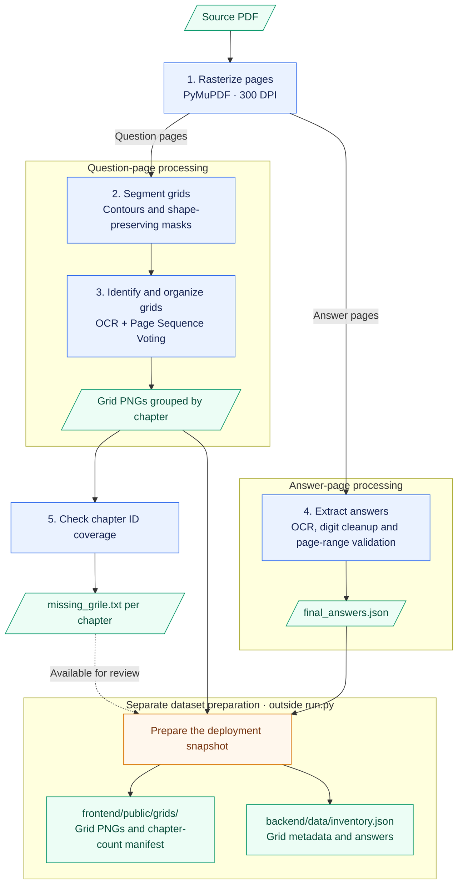
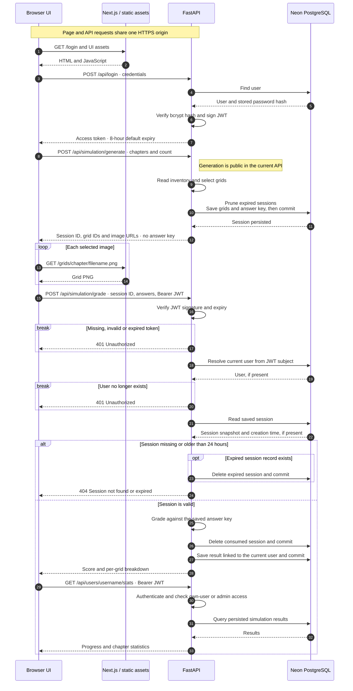

# MathSim
**Grid test digitization and automatic grading application**

MathSim transforms a static PDF containing nearly 1000 math grids into an interactive web platform for exam simulations, automatic grading, and progress tracking.

**Live demo: [mathsim-lac.vercel.app](https://mathsim-lac.vercel.app)**

Create a student account, choose your chapters, complete a simulation, and track your results. The interface is in Romanian.

## Preview

> **Screenshot placeholder — Exam simulation**
>
> Question image, answer selection, timer and navigation.

<!-- Replace the placeholder above with the screenshot when available:

-->

> **Screenshot placeholder — Student statistics (dark mode)**
>
> Progress chart, chapter accuracy and period filters.

<!-- Replace the placeholder above with the screenshot when available:

-->

## Architecture



Solid arrows show processing or runtime requests; dashed arrows show
deployment-time artifact delivery. Browser API calls use the shared origin,
with authentication and access checks enforced by FastAPI.

Two runtime services and an offline computer vision pipeline:

- **CV Pipeline** — extracts grid images and the answer key from the source PDF; runs locally when preparing the dataset
- **FastAPI Backend** — handles authentication, simulations, grading, and statistics
- **Next.js Frontend** — serves the interface and grid images; calls the API from the browser and never connects directly to the database

Production uses **Vercel Hobby Services + Neon Free**. The root [`vercel.json`](vercel.json)
defines `backend` and `frontend` as services sharing one domain. API routes keep
their `/api` prefix. There are no server-to-server calls requiring service bindings.

The dataset contains **959 distinct numbered questions across 651 PNG images**;
some images contain multiple questions. The images, public chapter manifest,
backend inventory and five slideshow images are included in the repository,
so running the web application does not require the offline pipeline.

For this self-study demo, the answer key is deliberately included in the public
repository to make the practice dataset reproducible. Grading uses the backend
inventory; the answer key is not served as a frontend static asset.

Locally, Docker Compose runs the frontend, backend, and PostgreSQL. Tests use a
separate, temporary PostgreSQL container.

## Key Features

### Digitization Pipeline
- **Contour-based segmentation** — grid extraction from PDF using Suzuki-Abe contour detection and the original *Contour Masking* technique, which preserves the exact shape of each grid (circle + rectangle) rather than a rough bounding box
- **Page Sequence Voting** — original algorithm that exploits consecutive grid numbering to correct OCR errors without manual validation; achieves 100% accuracy (959/959 grids)
- **Automated answer key extraction** — processes 4 ultra-dense pages (~240 answers/page, 6 columns) using morphological dilation with interval validation (*Ghost Digit Cleanup*, *Page Range Validation*)
- **CPU parallelization** — multi-core processing with zero synchronization overhead; 7.2× speedup over sequential mode (8.7s vs 62.9s for 142 pages)



`run.py --all` executes the stages in order, with worker processes inside
segmentation, indexing and answer extraction. Coverage validation writes a
report; the deployment snapshot is prepared separately.

### Web Platform
- **Secure authentication** — JWT + bcrypt, two roles (student, admin), 8-hour token expiry by default
- **Custom simulations** — weighted, randomized selection by chapter (Algebra, Analysis, Geometry, Trigonometry, Admission), without repeating image files within a session
- **Interactive quiz** — countdown timer, auto-submit on expiry, free navigation between grids, double navigation guard to prevent accidental exit
- **Automatic grading** — 0–10 scale with per-grid breakdown (submitted answer, expected answer, correct/wrong status)
- **Learning analytics** — time-based progress chart (LineChart), per-chapter accuracy bars, last-30-days and all-time filters
- **Admin panel** — global statistics, weekly activity, per-chapter distribution, user management (promote/delete)
- **Grid preview** — from the results page, any wrong answer can be visually inspected to see the original grid image
- **Session expiry** — unfinished simulation sessions expire after 24 hours
- **Dark mode** — persistent theme selection across pages



Sessions persist in PostgreSQL across function restarts. Session consumption
and result persistence currently use separate commits.

## Project Structure

```text
MathSim/
├── backend/                # FastAPI (Auth, Simulations)
│   ├── data/inventory.json  # Grid metadata and answer key
│   ├── routers/            # auth, simulation, admin
│   ├── services/           # Business logic
│   ├── init_db.py           # Explicit PostgreSQL schema initialization
│   └── tests/              # pytest against isolated PostgreSQL
├── frontend/               # Next.js 16 (App Router, Tailwind CSS)
│   ├── public/             # Grid PNGs, chapter manifest, slideshow images
│   └── src/
│       ├── app/            # Pages (student, admin, auth)
│       ├── components/     # Navbar, AuthForm, ThemeProvider, admin UI
│       ├── hooks/          # useAuth, useUserStats, useChapters
│       └── lib/            # API client, auth, constants
├── pipeline/               # CV Pipeline (offline)
│   └── src/                # pdf2image, segmenter, indexer, answers, validator
├── data/                   # Local offline pipeline inputs and outputs
├── docs/DEPLOYMENT.md       # Vercel + Neon setup and verification
├── docker-compose.yml      # Local stack + isolated test profile
├── vercel.json             # Multi-service deployment and public routing
└── .env.example            # Environment variable template
```

## Installation

### Local development with Docker

Requires Docker with Docker Compose v2. Run commands from the repository root.
Create `.env` if it does not already exist, then generate a JWT signing key:

```bash
test -f .env || cp .env.example .env

docker run --rm python:3.12-slim python -c "import secrets; print(secrets.token_hex(32))"
```

Set `SECRET_KEY` in `.env` to the generated value **before starting the app**.
For an existing `.env`, use [`.env.example`](.env.example) as the reference.
The example database credentials are for local Docker only. If changing the
password, update both `POSTGRES_PASSWORD` and `DATABASE_URL`, URL-encoding
special characters in the connection URL.

```bash
docker compose up -d postgres

# Initialize the schema once, before starting the application
docker compose run --rm --build backend python init_db.py
docker compose up -d --build
```

Access: **Frontend** `http://localhost:3000` | **Backend API** `http://localhost:8000`

PostgreSQL runs on the internal Docker network and is not exposed on a host
port. The `postgres_data` volume preserves local data between restarts.
`docker compose down` preserves it; **`docker compose down -v` deletes it**.
PostgreSQL is the only supported database. It starts empty, and application
startup never creates tables.

`SECRET_KEY` is mandatory: the backend refuses to start if it is blank or
shorter than 32 characters. Use the random generator above, not a password or
an example value. Keep the key stable across restarts; changing it invalidates
existing JWTs and users must log in again.

### Offline Pipeline

Requires Python 3.12 and the Tesseract OCR executable on `PATH`. Place the source
PDF at `data/raw/culegere_grile_utcn.pdf`; it is not included in the repository.
The pipeline's page ranges and chapter layout are configured for that document
in `pipeline/src/configs/config.py`.

```bash
python3.12 -m venv .venv
source .venv/bin/activate
python -m pip install -r pipeline/requirements.txt
python pipeline/run.py --all
```

Outputs are written under `data/temp/` and `data/processed/`. Add `--clean` to
delete those previous outputs before regenerating them. Running the pipeline
does not automatically replace the deployed assets in `frontend/public/grids/`
or `backend/data/inventory.json`; those are a separately prepared snapshot.

### Tests

The backend suite contains **70 automated test cases**, including parametrized
cases, covering:

- Registration, login, JWT validation, and student/admin access rules.
- Grading, the 24-hour session expiry boundary, and session cleanup.
- Result persistence and statistics through the API.
- PostgreSQL configuration, schema initialization, and test-database isolation.

From the repository root, with `.env` configured as above:

```bash
docker compose --profile test run --rm --build tests

# Remove only the test containers; leave the application's data alone
docker compose --profile test rm --stop --force postgres-test
```

Tests use isolated PostgreSQL (`postgres-test/mathsim_test`) with temporary
in-memory storage and no public ports. Fixtures require `TEST_DATABASE_URL`
to target that service before importing the application or connecting; the
application database and Neon are never used by this profile.

The test image installs `backend/requirements-test.txt`; its fixed JWT signing
key is for tests only. **Backend code coverage has not been measured.**

Frontend validation has included linting, type checking, production builds and
browser smoke checks; no automated frontend test suite is checked into the
repository.

## Deployment: Vercel Services + Neon

- **Hosting:** one Vercel Hobby project, with Next.js and FastAPI sharing a domain.
- **Database:** Neon Free PostgreSQL with external pooling and SQLAlchemy `NullPool`.
- **Runtime:** Python 3.12 and Node 24.x; schema initialization is explicit.
- **Configuration:** secrets stay in Vercel; the public API origin is set at build time.

See the [deployment guide](docs/DEPLOYMENT.md) for database setup, environment
variables, dashboard steps and production checks.

## Performance & Testing

| Metric | Value |
|--------|-------|
| Grid segmentation | **100%** (959/959) |
| Answer key extraction | **98%** (19 out of 959 entries missing, 8 of which omitted in source) |
| Automated tests | **70 backend test cases** — pytest against isolated PostgreSQL; code coverage not measured |
| API latency (100 concurrent clients) | **~12.5 ms** average (Locust) |
| Parallelization speedup | **7.2×** (8.7s on 8 cores vs 62.9s sequential) |

## Tech Stack

| Layer | Technology |
|-------|------------|
| CV / OCR | Python 3.12, OpenCV, Tesseract, PyMuPDF |
| Backend | Python 3.12, FastAPI, SQLAlchemy, psycopg, PostgreSQL |
| Frontend | Node.js 24, Next.js 16.4, React 19, TypeScript, Tailwind CSS, Recharts |
| Local development | Docker, Docker Compose, PostgreSQL 17 |
| Deployment | Vercel Hobby (Services), Neon Free (PostgreSQL) |
