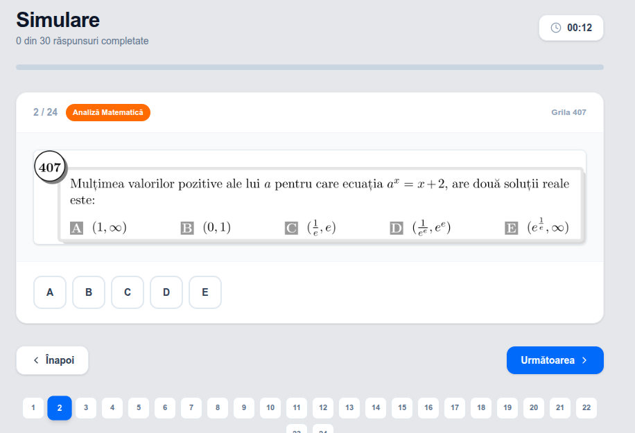
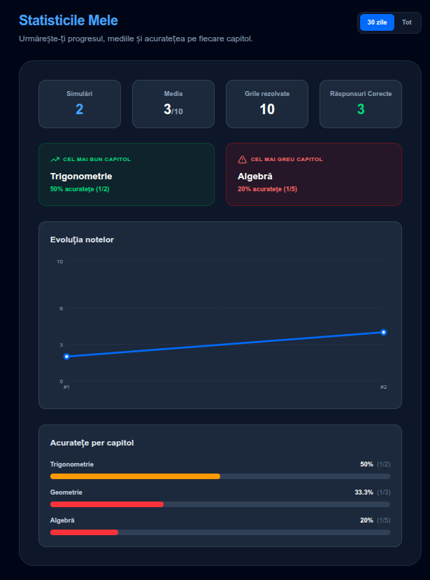
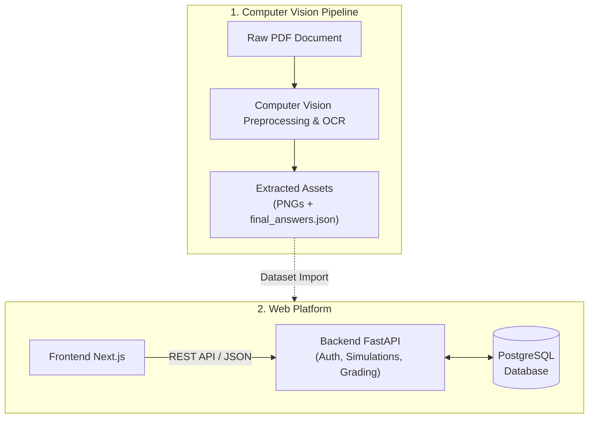
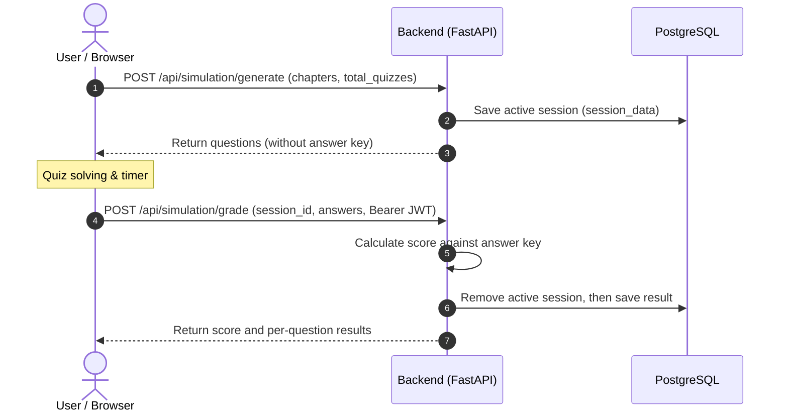

# MathSim
**Grid test digitization and automatic grading application**

MathSim transforms a static PDF containing nearly 1000 math grids into an interactive web platform for exam simulations, automatic grading, and progress tracking.

**Live demo: [mathsim-lac.vercel.app](https://mathsim-lac.vercel.app)**

Create a student account to get started. The interface is in Romanian.

## Using MathSim

### Solve a simulation

Choose from Algebra, Analysis, Geometry, Trigonometry and Admission questions,
then generate a timed simulation with weighted chapter selection. Navigate
between questions and submit your answers, or let the timer submit them on expiry.



### Review your progress

Each submission receives a score from 0 to 10 and a per-question breakdown,
with image previews to revisit mistakes. Saved results feed the statistics
dashboard, showing score trends and chapter accuracy for the last 30 days or all time.



The platform also includes persistent dark mode and an admin panel for global
statistics and user management, with separate student and administrator access.

## How it works

### Architecture

MathSim separates offline dataset preparation from the running web application.
The computer vision pipeline produces the questions and answer key; Next.js and
FastAPI deliver simulations backed by PostgreSQL.



The frontend serves the interface and images, making API calls from the browser.
FastAPI handles authentication, grading and database access; the frontend never
connects directly to PostgreSQL.

### PDF digitization and dataset

The offline pipeline turns the source PDF into reusable question images and an
answer key through four main techniques:

- **Contour Masking** - contour-based segmentation preserves each grid's shape.
- **Page Sequence Voting** - consecutive question numbering helps correct OCR errors.
- **Answer extraction** - morphological dilation, Ghost Digit Cleanup and Page Range Validation process the answer pages.
- **Parallel processing** - worker processes accelerate segmentation, indexing and answer extraction.

The prepared dataset contains **959 distinct numbered questions across 651 PNG
images**; some images contain multiple questions. Images, the chapter manifest
and backend inventory are bundled, so the web app runs without executing the pipeline.

For reproducibility, this self-study demo includes the answer key in the public
repository. It is bundled with the backend, not served as a frontend static asset.

### Simulation lifecycle

For each simulation, FastAPI selects questions from the inventory and saves
their answer key in an active session. On submission, it grades against that
saved session and records the result for the student's progress history.



Sessions persist in PostgreSQL across function restarts and expire after 24 hours;
grading requires a valid JWT. Session consumption and result persistence currently
use separate commits.

### Tech stack

| Layer | Technology |
|-------|------------|
| CV / OCR | Python 3.12, OpenCV, Tesseract, PyMuPDF |
| Backend | Python 3.12, FastAPI, SQLAlchemy, psycopg, PostgreSQL, JWT, bcrypt |
| Frontend | Node.js 24, Next.js 16.4, React 19, TypeScript, Tailwind CSS, Recharts |
| Infrastructure | Docker Compose, PostgreSQL 17 locally, Vercel Hobby Services, Neon Free |

## Run locally

### Local development with Docker

Requires Docker with Docker Compose v2 or newer. Commands use Bash and run from
the repository root. For a first-time setup, create `.env` and generate a JWT key:

```bash
test -f .env || cp .env.example .env

docker run --rm python:3.12-slim python -c "import secrets; print(secrets.token_hex(32))"
```

Set `SECRET_KEY` in `.env` to the generated value. For an existing setup, keep
your key and check the local URLs against [`.env.example`](.env.example).
The example credentials are for local Docker only. Choose any replacement
password before initializing PostgreSQL, updating both `POSTGRES_PASSWORD` and
`DATABASE_URL` (URL-encode special characters in the URL). Changing `.env` alone
does not change the password stored in an existing database volume.

```bash
docker compose up -d postgres

# Initialize the schema once, before starting the application
docker compose run --rm --build backend python init_db.py
docker compose up -d --build
```

Access: **Frontend** `http://localhost:3000` | **Backend API** `http://localhost:8000`

PostgreSQL stays on the internal Docker network, with data persisted in
`postgres_data`. `docker compose down` preserves it; **`docker compose down -v`
deletes it**. Schema initialization is manual; application startup never creates
tables. Keep `SECRET_KEY` stable across restarts to preserve existing JWTs.

### Optional: regenerate the dataset

To rerun digitization, install Python 3.12 with `venv` support and Tesseract OCR
on `PATH`, including its English (`eng`) language data. Place the source PDF at
`data/raw/culegere_grile_utcn.pdf` (not included); page ranges and chapter layout
in `pipeline/src/configs/config.py` are specific to that document.

```bash
python3.12 -m venv .venv
source .venv/bin/activate
python -m pip install -r pipeline/requirements.txt
python pipeline/run.py --all
```

Outputs go to `data/temp/` and `data/processed/`; `--clean` deletes previous outputs.
Preparing `frontend/public/grids/` and `backend/data/inventory.json` from them
is a separate step.

## Testing and performance

The **70 backend test cases**, including parametrizations, cover authentication,
student/admin authorization, grading, session expiry, saved statistics and
database initialization. Run them from the repository root with `.env` configured:

```bash
docker compose --profile test run --rm --build tests

# Remove only the test containers; leave the application's data alone
docker compose --profile test rm --stop --force postgres-test
```

Compose supplies a separate, temporary PostgreSQL database (`postgres-test/mathsim_test`)
and a test-only JWT key. Fixtures reject database URLs outside that service;
the application database and Neon are never used by this profile.

Backend code coverage has not been measured. Frontend validation has included
linting, type checking, production builds and browser smoke checks; no automated
frontend suite is checked into the repository.

### Performance

| Metric | Value |
|--------|-------|
| Grid segmentation | **100%** (959/959) |
| Answer key extraction | **98%** (19 out of 959 entries missing, 8 of which omitted in source) |
| API latency (100 concurrent clients) | **~12.5 ms** average (Locust) |
| Parallelization speedup | **7.2×** (8.7s on 8 cores vs 62.9s sequential) |

## Deployment

The live demo uses one **Vercel Hobby Services** project and **Neon Free**.
[`vercel.json`](vercel.json) routes `/api/*` to FastAPI and other paths to Next.js
on the same domain. Database connections use Neon's pooler with SQLAlchemy `NullPool`.

See the [deployment guide](docs/DEPLOYMENT.md) for database initialization,
environment variables, frontend rebuilds and production checks.

## Project structure

```text
MathSim/
├── backend/                # FastAPI, database models, inventory and pytest suite
├── frontend/               # Next.js interface, grid images and chapter manifest
├── pipeline/               # Offline PDF segmentation, OCR and answer extraction
├── data/                   # Local pipeline inputs and outputs (not tracked)
├── docs/DEPLOYMENT.md       # Vercel + Neon setup and verification
├── docker-compose.yml      # Local stack and isolated test profile
├── vercel.json             # Production services and routing
└── .env.example            # Local environment template
```
